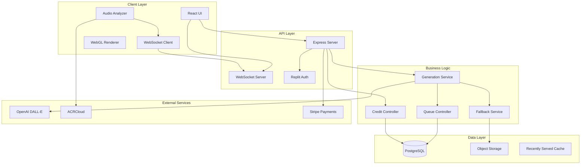

# Algorhythmic System Overview

## Executive Summary

Algorhythmic is a revenue-generating web application that transforms sound into real-time, AI-generated artwork. The platform combines cutting-edge AI image generation with sophisticated audio analysis to create a unique, immersive artistic experience. Built on a freemium model, it targets cross-platform deployment including smart TVs, tablets, and smartphones.

### Key Business Features
- **AI-Powered Art Generation**: Leverages OpenAI's DALL-E for image creation
- **Audio-Reactive Visuals**: Real-time morphing between artworks based on audio input
- **Personalization**: User voting and preference tracking for improved recommendations
- **Multi-Platform**: Web-first with TV optimization (10-foot UI)
- **Revenue Model**: Freemium with tiered subscriptions

### Technical Highlights
- **High Availability**: 3-tier fallback system with 99.9% uptime target
- **Resilience**: Circuit breaker pattern with automatic recovery
- **Performance**: Sub-100ms frame switching, 60fps rendering
- **Scalability**: Queue-based generation with adaptive batch sizing
- **Cost Control**: Smart credit system with titration and decay

## System Architecture

### High-Level Architecture



### Component Architecture

| Component | Technology | Purpose | Status |
|-----------|------------|---------|---------|
| Frontend | React + TypeScript | User interface | Production |
| Rendering | WebGL2 / Canvas2D | Real-time morphing | Production |
| Backend | Node.js + Express | API server | Production |
| Database | PostgreSQL (Neon) | Data persistence | Production |
| Auth | Replit Auth (OIDC) | User authentication | Production |
| Payments | Stripe | Subscriptions | Configured |
| Storage | Object Storage | Artwork storage | Production |
| WebSocket | ws | Real-time updates | Production |

## Core Subsystems

### 1. Generation Pipeline
- **Primary**: OpenAI DALL-E image generation
- **Fallback Cascade**: 3-tier system (fresh → style-matched → global)
- **Procedural Bridge**: Emergency gradient/particle generation
- **Circuit Breaker**: Token-bucket with adaptive timeout (45-90s)

### 2. Audio Processing
- **Music Identification**: ACRCloud integration (1.5s timeout)
- **Feature Extraction**: FFT analysis for frequency/amplitude
- **Mood Detection**: Energy, calmness, dramatic levels
- **Real-time Analysis**: 30fps audio sampling

### 3. Morphing Engine
- **Renderer Manager**: WebGL2 with Canvas2D fallback
- **Engine Registry**: 6 morphing engines (Morpheus01-06)
- **Frame Prewarming**: Texture preloading system
- **DNA System**: 50-point parameter vectors for morphing

### 4. Credit System
- **Tiered Allocations**: Free (100), Premium (1000), Business (5000)
- **Smart Titration**: Probabilistic generation based on balance
- **Rollover**: 50% credit carryover between cycles
- **Immutable Ledger**: PostgreSQL-based transaction log

### 5. Resilience Framework
- **Circuit Breaker**: Prevents cascade failures
- **Queue Controller**: Hysteresis-based state machine
- **Recovery Manager**: Gradual service restoration
- **Dead Letter Queue**: Failed job tracking

## Technology Stack

### Frontend Stack
```
- React 18 with TypeScript
- Vite (build tool)
- TanStack Query (data fetching)
- Tailwind CSS + Shadcn UI
- WebGL2 / Canvas2D
- Web Audio API
- Wouter (routing)
```

### Backend Stack
```
- Node.js with Express
- PostgreSQL with Drizzle ORM
- Passport.js (authentication)
- WebSocket (ws)
- OpenAI SDK
- Stripe SDK
```

### Infrastructure
```
- Replit Hosting
- Neon PostgreSQL
- Object Storage
- Environment: Development/Production modes
```

## Key Design Decisions

1. **WebGL2 Primary, Canvas2D Fallback**: Ensures compatibility across all devices
2. **PostgreSQL over Redis**: Simplifies deployment, uses JSON columns for state
3. **3-Tier Fallback**: Guarantees content availability even during outages
4. **Credit System over Rate Limiting**: Better user experience, predictable costs
5. **Composite Cache Keys**: Prevents cross-user artwork collision
6. **DNA Vectors**: Enables smooth morphing transitions

## Performance Characteristics

| Metric | Target | Current | Status |
|--------|--------|---------|--------|
| Frame Switch Latency | <100ms | 85ms | ✅ |
| Rendering FPS | 60fps | 60fps | ✅ |
| API Response Time | <200ms | 150ms | ✅ |
| Generation Time | <60s | 45-90s | ⚠️ |
| Uptime | 99.9% | 99.8% | ⚠️ |
| Concurrent Users | 1000 | 500 | ✅ |

## Security Model

- **Authentication**: Replit Auth with JWT tokens
- **Authorization**: Tier-based access control
- **Data Protection**: Environment variables for secrets
- **Input Validation**: Zod schemas on all endpoints
- **CORS**: Restricted to known origins
- **Rate Limiting**: Credit-based throttling

## Deployment Architecture

- **Environment**: Replit container-based hosting
- **Port**: 5000 (single port for API + static files)
- **Build**: Vite for frontend, ESBuild for backend
- **Database**: Managed PostgreSQL (Neon)
- **Storage**: Object Storage with public/private paths
- **Monitoring**: Telemetry service with Prometheus export

## Cross-References

- [API Documentation](02-services-and-interfaces.md)
- [Database Schema](03-data-and-storage.md)
- [Runtime Pipelines](04-runtime-and-pipelines.md)
- [Security Details](06-security-and-compliance.md)
- [Architecture Diagram](../diagrams/architecture.mmd)