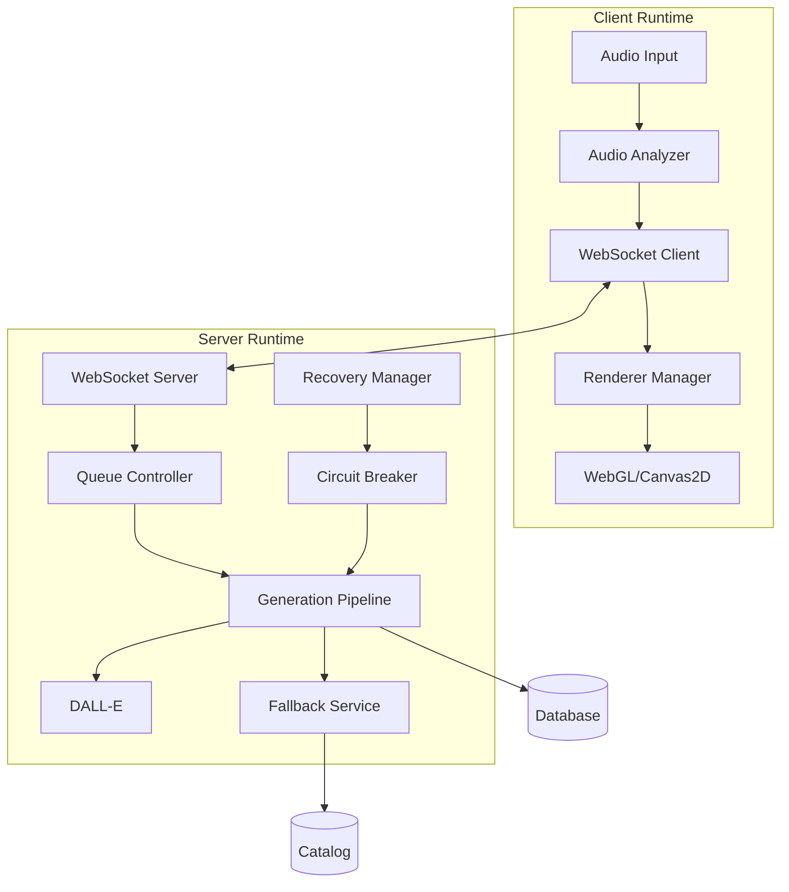
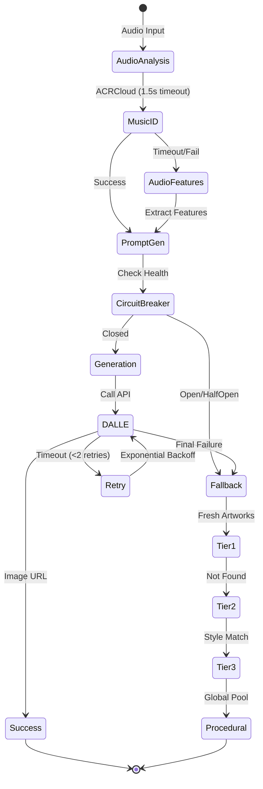
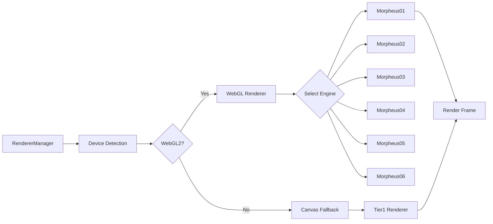
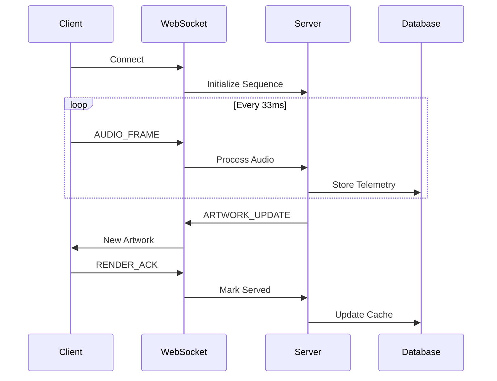
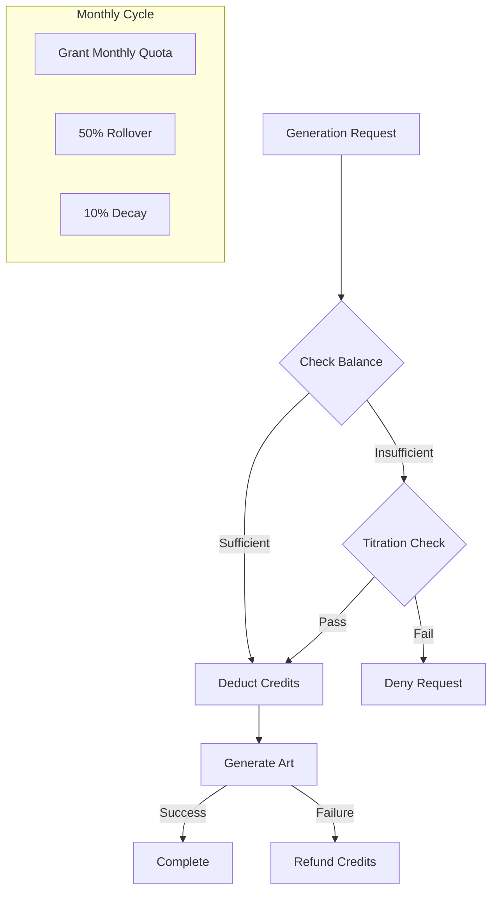

# Runtime and Pipelines Documentation

## System Runtime Overview

The Algorhythmic platform operates as a real-time audio-reactive art generation system with multiple concurrent pipelines processing audio, generating artwork, and rendering morphing visuals.

### Runtime Architecture



## Core Runtime Pipelines

### 1. Audio Processing Pipeline

**Purpose**: Real-time audio analysis for reactive art generation

#### Pipeline Flow
```
Audio Input → Web Audio API → FFT Analysis → Feature Extraction → WebSocket Transmission
```

#### Components

**AudioAnalyzer** (`client/src/lib/audio-analyzer.ts`)
```typescript
class AudioAnalyzer {
  sampleRate: 44100 Hz
  fftSize: 2048
  smoothingConstant: 0.8
  
  analyzeFrame(): AudioFeatures {
    // Extract frequency spectrum
    // Calculate amplitude RMS
    // Detect bass/treble levels
    // Estimate BPM
    // Determine mood
  }
}
```

**Feature Extraction**
- **Frequency**: Dominant frequency bin
- **Amplitude**: RMS calculation
- **Bass Level**: 20-250 Hz energy
- **Treble Level**: 4000-20000 Hz energy
- **Tempo**: BPM detection via onset detection
- **Mood**: Energy/valence mapping

#### Processing Rate
- **Sampling**: 30 fps (33ms intervals)
- **FFT Window**: 46ms (2048 samples)
- **Latency**: <50ms end-to-end

### 2. Image Generation Pipeline

**Purpose**: AI-powered artwork creation with resilience

#### Pipeline Stages



#### Generation Components

**OpenAI Service** (`server/openai-service.ts`)
```typescript
async generateArtImage(prompt: string, options?: GenerationOptions) {
  // 1. Check circuit breaker
  if (!health.shouldAttemptGeneration()) {
    throw new GenerationFailure('unavailable');
  }
  
  // 2. Adaptive timeout (P95 + 10s)
  const timeout = health.getTimeout(); // 45-90s
  
  // 3. Generate with AbortController
  const controller = new AbortController();
  const result = await Promise.race([
    openai.images.generate({
      prompt,
      n: 1,
      size: "1024x1024",
      signal: controller.signal
    }),
    timeoutPromise(timeout)
  ]);
  
  // 4. Record metrics
  health.recordSuccess(jobId, latency);
  
  return result.data[0].url;
}
```

**Prompt Generation Logic**
```typescript
function generatePrompt(context: GenerationContext): string {
  const base = context.musicInfo 
    ? `Art inspired by ${context.musicInfo.title} by ${context.musicInfo.artist}`
    : `Abstract art with ${context.audioAnalysis.mood} mood`;
    
  const styles = context.stylePreferences.styles.join(", ");
  const directive = "no text, no letters, pure visual art only";
  
  return `${base}, ${styles} style, ${directive}`;
}
```

### 3. Fallback Cascade Pipeline

**Purpose**: Ensure content availability during failures

#### Cascade Tiers

| Tier | Source | Latency | Success Rate |
|------|--------|---------|--------------|
| 1. Fresh | Recent generations | <50ms | 60% |
| 2. Style-Match | Catalog by style | <100ms | 30% |
| 3. Global | Any catalog | <100ms | 9% |
| 4. Procedural | Generated gradient | <10ms | 100% |

#### Implementation
```typescript
async resolveEmergencyFallback(storage, sessionId, userId, options) {
  // Tier 1: Fresh artworks
  if (sessionId) {
    const fresh = await storage.getFreshArtworks(sessionId, userId, 20);
    if (fresh.length >= minFrames) {
      return { artworks: fresh, tier: 'fresh' };
    }
  }
  
  // Tier 2: Style-matched catalog
  const styleMatched = await storage.getCatalogByStyles(
    options.styleTags,
    options.orientation
  );
  if (styleMatched.length >= minFrames) {
    return { artworks: styleMatched, tier: 'style-matched' };
  }
  
  // Tier 3: Global catalog
  const global = await storage.getRandomCatalog(minFrames);
  if (global.length >= minFrames) {
    return { artworks: global, tier: 'global' };
  }
  
  // Tier 4: Procedural generation
  const procedural = await generateProceduralBridge();
  return { artworks: procedural, tier: 'procedural' };
}
```

### 4. Morphing Render Pipeline

**Purpose**: Smooth visual transitions between artworks

#### Rendering Architecture



#### Morphing Process
```typescript
class MorphEngine {
  morphFactor: 0.0 to 1.0  // Transition progress
  frameA: WebGLTexture      // Current image
  frameB: WebGLTexture      // Next image
  dnaA: Float32Array        // 50-point vector
  dnaB: Float32Array        // 50-point vector
  
  update(deltaTime: number) {
    // Update morph factor
    this.morphFactor += deltaTime * this.morphSpeed;
    
    // Interpolate DNA vectors
    const interpolatedDNA = lerp(this.dnaA, this.dnaB, this.morphFactor);
    
    // Apply effects based on DNA
    this.applyEffects(interpolatedDNA);
    
    // Render blended frame
    this.render();
  }
}
```

#### DNA Vector Mapping (50 points)

| Points | Parameter | Effect |
|--------|-----------|--------|
| 1-12 | Color Palette | Hue, saturation, brightness |
| 13-24 | Texture | Noise, grain, smoothness |
| 25-33 | Motion | Speed, direction, turbulence |
| 34-39 | Geometry | Distortion, scaling |
| 40-45 | Effects | Blur, glow, particles |
| 46-50 | Special | Engine-specific params |

### 5. WebSocket Communication Pipeline

**Purpose**: Real-time bidirectional communication

#### Message Flow



#### Sequence Management
```typescript
class WebSocketSequenceManager {
  // Monotonic sequence IDs
  getNextClientSequence(clientId: string): number {
    const current = this.clientSequences.get(clientId) || 0;
    return current + 1;
  }
  
  // ACK tracking
  trackMessage(clientId: string, message: any, seq: number) {
    this.pendingMessages.get(clientId).push({
      seq,
      message,
      timestamp: Date.now(),
      retryCount: 0
    });
  }
  
  // Retry failed messages
  async retryPending(clientId: string) {
    const pending = this.pendingMessages.get(clientId);
    for (const msg of pending) {
      if (msg.retryCount < MAX_RETRY) {
        await this.resend(clientId, msg);
      }
    }
  }
}
```

### 6. Credit Control Pipeline

**Purpose**: Manage generation costs and user quotas

#### Credit Flow



#### Credit Controller Logic
```typescript
class CreditController {
  async shouldGenerate(userId: string): Promise<DecisionResult> {
    const balance = await this.getBalance(userId);
    const tier = await this.getUserTier(userId);
    
    // High balance: always generate
    if (balance > tier.quota * 0.5) {
      return { decision: 'grant', probability: 1.0 };
    }
    
    // Low balance: titration
    if (balance > 0 && balance <= tier.quota * 0.1) {
      const probability = balance / (tier.quota * 0.2);
      const random = Math.random();
      return {
        decision: random < probability ? 'grant' : 'deny',
        probability
      };
    }
    
    // No balance: deny
    if (balance <= 0) {
      return { decision: 'deny', probability: 0 };
    }
    
    // Normal balance
    return { decision: 'grant', probability: 1.0 };
  }
}
```

## Runtime Configuration

### Environment Variables

```bash
# Core Runtime
NODE_ENV=development|production
PORT=5000

# Generation Pipeline
OPENAI_API_KEY=<key>
GEN_BREAKER_ENABLED=true
GEN_TIMEOUT_MIN=45000
GEN_TIMEOUT_MAX=90000

# Fallback Settings
FALLBACK_MIN_FRAMES=2
FALLBACK_CACHE_TTL=3600000

# WebSocket
WS_ACK_TIMEOUT=5000
WS_MAX_RETRY=3
WS_HEARTBEAT_INTERVAL=30000

# Credit System
CREDIT_TITRATION_ENABLED=true
CREDIT_ROLLOVER_PERCENT=50
CREDIT_DECAY_PERCENT=10
```

### Performance Tuning

| Parameter | Default | Recommended | Impact |
|-----------|---------|-------------|--------|
| `fftSize` | 2048 | 2048-4096 | Audio resolution |
| `morphSpeed` | 0.5 | 0.3-0.8 | Transition speed |
| `preWarmCount` | 2 | 2-4 | Memory vs latency |
| `queueTarget` | 3 | 2-5 | Buffer size |
| `circuitTokens` | 5 | 3-10 | Failure tolerance |

## Monitoring & Telemetry

### Key Metrics

```typescript
// Generation Pipeline
{
  "gen.request": { count, latency, success_rate },
  "gen.timeout": { count, duration },
  "gen.fallback": { tier, count, latency },
  "breaker.state": { state, tokens, transitions }
}

// Rendering Pipeline  
{
  "render.fps": { current, target, drops },
  "render.latency": { frame_switch, texture_load },
  "render.engine": { type, switches, failures }
}

// Credit System
{
  "credit.balance": { user_count, total, average },
  "credit.deductions": { count, amount, refunds },
  "credit.titration": { attempts, grants, denies }
}
```

### Health Checks

```javascript
// Circuit Breaker Health
GET /api/monitoring/resilience
{
  circuitBreaker: {
    state: "closed|open|half_open",
    successRate: 0.95,
    p95Latency: 55000,
    tokens: 0
  }
}

// Queue Health
{
  queueController: {
    state: "SATISFIED",
    queueSize: 3,
    generationRate: 2.5,
    consumptionRate: 2.3
  }
}
```

## Error Handling

### Pipeline Failures

| Pipeline | Failure Mode | Recovery Strategy |
|----------|-------------|------------------|
| Audio | No input | Use default analysis |
| Generation | Timeout | Retry with backoff |
| Generation | Circuit open | Fallback cascade |
| Rendering | WebGL crash | Canvas2D fallback |
| WebSocket | Disconnect | Auto-reconnect |
| Credit | Insufficient | Titration or deny |

### Dead Letter Queue

Failed jobs are tracked for analysis:
```typescript
interface DeadLetterJob {
  id: string;
  prompt: string;
  attemptCount: number;
  errors: Array<{
    timestamp: number;
    reason: string;
  }>;
}
```

## Cross-References

- [System Overview](00-system-overview.md)
- [API Documentation](02-services-and-interfaces.md)
- [Operations Runbook](07-ops-runbook.md)
- [Request Lifecycle Diagram](../diagrams/request-lifecycle.mmd)