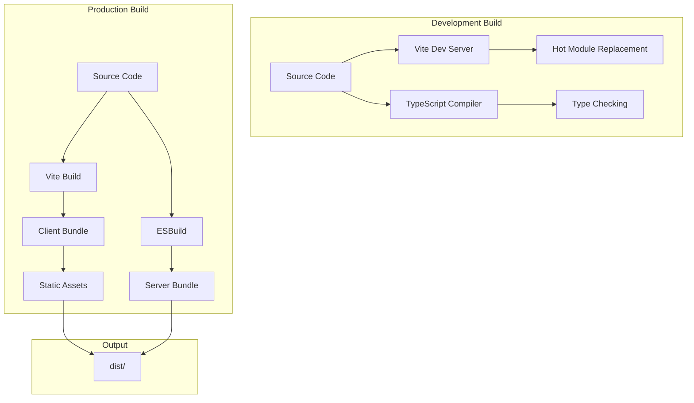

# Build, Test, and Deployment Documentation

## Build System Overview

Algorhythmic uses modern JavaScript tooling with Vite for frontend bundling and ESBuild for backend compilation. The build system is optimized for both development speed and production performance.

### Build Architecture



## Build Configuration

### Package Scripts

```json
{
  "scripts": {
    "dev": "NODE_ENV=development tsx server/index.ts",
    "build": "vite build && esbuild server/index.ts --platform=node --packages=external --bundle --format=esm --outdir=dist",
    "start": "NODE_ENV=production node dist/index.js",
    "check": "tsc",
    "db:push": "drizzle-kit push",
    "test:e2e": "playwright test"
  }
}
```

### Vite Configuration

```typescript
// vite.config.ts
export default defineConfig({
  plugins: [
    react(),
    runtimeErrorOverlay(),
    // Replit-specific plugins in dev
    ...(process.env.NODE_ENV !== "production" && process.env.REPL_ID
      ? [cartographer(), devBanner()]
      : [])
  ],
  resolve: {
    alias: {
      "@": "./client/src",
      "@shared": "./shared",
      "@assets": "./attached_assets"
    }
  },
  root: "./client",
  build: {
    outDir: "../dist/public",
    emptyOutDir: true,
    // Optimizations
    rollupOptions: {
      output: {
        manualChunks: {
          'vendor': ['react', 'react-dom'],
          'ui': ['@radix-ui/*'],
          'rendering': ['./lib/renderers/*']
        }
      }
    }
  }
});
```

### TypeScript Configuration

```typescript
// tsconfig.json
{
  "compilerOptions": {
    "target": "ESNext",
    "module": "ESNext",
    "lib": ["ESNext", "DOM", "DOM.Iterable"],
    "jsx": "preserve",
    "strict": true,
    "esModuleInterop": true,
    "skipLibCheck": true,
    "moduleResolution": "bundler",
    "allowImportingTsExtensions": true,
    "noEmit": true,
    "paths": {
      "@/*": ["./client/src/*"],
      "@shared/*": ["./shared/*"]
    }
  },
  "include": ["client/src/**/*", "server/**/*", "shared/**/*"],
  "exclude": ["node_modules", "dist", "build"]
}
```

## Build Process

### Development Build

```bash
# Start development server
npm run dev

# What happens:
1. TypeScript compiles server code with tsx
2. Vite starts dev server on port 5000
3. Hot Module Replacement enabled
4. Source maps generated
5. Type checking in background
```

### Production Build

```bash
# Build for production
npm run build

# Build steps:
1. Vite builds client bundle
   - Tree shaking
   - Code splitting
   - Asset optimization
   - Minification
   
2. ESBuild compiles server
   - Bundle dependencies
   - Transpile TypeScript
   - Generate source maps
   
3. Output structure:
   dist/
   ├── index.js          # Server entry
   ├── public/           # Client assets
   │   ├── index.html
   │   ├── assets/
   │   │   ├── index-[hash].js
   │   │   └── index-[hash].css
   │   └── _app/
   └── *.js             # Server modules
```

### Build Optimization

| Optimization | Impact | Configuration |
|--------------|--------|---------------|
| Code Splitting | -40% initial bundle | Manual chunks in Vite |
| Tree Shaking | -30% bundle size | Automatic with ESM |
| Minification | -60% file size | Terser in production |
| Compression | -70% transfer size | Gzip/Brotli on server |
| Asset Hashing | Cache busting | `[name]-[hash]` pattern |

## Testing Infrastructure

### Test Stack

- **E2E Testing**: Playwright
- **Unit Testing**: Vitest (planned)
- **Integration Testing**: Custom scripts
- **Load Testing**: k6 (planned)

### Playwright E2E Tests

```typescript
// playwright.config.ts
export default defineConfig({
  testDir: './tests/e2e',
  fullyParallel: false,
  workers: 1,
  
  use: {
    baseURL: process.env.BASE_URL || 'http://localhost:5000',
    trace: 'on-first-retry',
    screenshot: 'only-on-failure',
    video: 'retain-on-failure'
  },
  
  projects: [{
    name: 'chromium',
    use: { ...devices['Desktop Chrome'] }
  }],
  
  webServer: {
    command: 'npm run dev',
    port: 5000,
    reuseExistingServer: !process.env.CI
  }
});
```

### Test Suites

#### E2E Test Coverage

```typescript
// tests/e2e/art-generation.test.ts
describe('Art Generation Pipeline', () => {
  test('Frame A renders at full brightness', async ({ page }) => {
    // Navigate to display
    await page.goto('/display');
    
    // Analyze canvas
    const stats = await analyzeCanvas(page);
    expect(stats.avgLuminance).toBeGreaterThan(0.1);
    expect(stats.blackPixelPercent).toBeLessThan(95);
  });
  
  test('Morphing transitions work', async ({ page }) => {
    // Test frame switching
    const frameA = await getCanvasData(page);
    await page.waitForTimeout(5000);
    const frameB = await getCanvasData(page);
    
    expect(frameA).not.toEqual(frameB);
  });
  
  test('Fallback cascade activates', async ({ page }) => {
    // Force circuit breaker open
    await page.request.post('/api/test/force-breaker-open');
    
    // Request should still return artwork
    const response = await page.request.post('/api/test/generate');
    expect(response.ok()).toBeTruthy();
  });
});
```

### Running Tests

```bash
# Install Playwright browsers
npx playwright install chromium

# Run all tests
npm run test:e2e

# Run specific test
npx playwright test art-generation.test.ts

# Debug mode
npx playwright test --debug

# Generate report
npx playwright show-report
```

### Testing Best Practices

1. **Test Data Isolation**: Each test uses unique session IDs
2. **Cleanup**: Tests clean up generated data
3. **Retry Logic**: Flaky tests retry up to 2 times
4. **Parallel Execution**: Disabled for consistency
5. **Visual Regression**: Screenshot comparison for UI

## Deployment Process

### Deployment on Replit

#### Automatic Deployment

Replit automatically deploys when pushing to main branch:

```bash
# Push to deploy
git add .
git commit -m "feat: new feature"
git push origin main

# Replit deployment pipeline:
1. Detect push to main
2. Install dependencies
3. Run build script
4. Start production server
5. Health check
6. Route traffic to new version
```

#### Environment Configuration

```bash
# Production environment variables (set in Replit Secrets)
NODE_ENV=production
PORT=5000
DATABASE_URL=postgresql://...
OPENAI_API_KEY=sk-...
STRIPE_SECRET_KEY=sk_live_...
# ... other secrets
```

### Database Migrations

#### Migration Workflow

```bash
# 1. Generate migration from schema changes
npm run db:generate

# 2. Review migration file
cat migrations/0001_*.sql

# 3. Apply migration to development
DATABASE_URL=dev_url npm run db:push

# 4. Test thoroughly

# 5. Apply to production
DATABASE_URL=prod_url npm run db:push
```

#### Migration Safety

```sql
-- Safe migration example
BEGIN;

-- Add column with default
ALTER TABLE art_sessions 
ADD COLUMN IF NOT EXISTS quality_score INTEGER DEFAULT 50;

-- Create index concurrently
CREATE INDEX CONCURRENTLY IF NOT EXISTS 
  idx_art_sessions_quality ON art_sessions(quality_score);

-- Validate and commit
COMMIT;
```

### Deployment Checklist

#### Pre-Deployment

- [ ] All tests passing
- [ ] Type checking passes (`npm run check`)
- [ ] No console errors in development
- [ ] Database migrations prepared
- [ ] Environment variables configured
- [ ] Feature flags set appropriately
- [ ] Performance benchmarks met

#### Deployment Steps

1. **Create deployment branch**
   ```bash
   git checkout -b deploy/v1.2.3
   ```

2. **Update version**
   ```json
   {
     "version": "1.2.3"
   }
   ```

3. **Run pre-flight checks**
   ```bash
   npm run check
   npm run test:e2e
   npm run build
   ```

4. **Deploy to staging** (if available)
   ```bash
   git push origin deploy/v1.2.3
   ```

5. **Smoke test**
   - Check all critical paths
   - Verify external integrations
   - Monitor error rates

6. **Deploy to production**
   ```bash
   git checkout main
   git merge deploy/v1.2.3
   git push origin main
   ```

#### Post-Deployment

- [ ] Monitor error rates
- [ ] Check circuit breaker status
- [ ] Verify credit system functioning
- [ ] Test critical user paths
- [ ] Monitor performance metrics
- [ ] Check telemetry dashboard

### Rollback Procedures

#### Quick Rollback

```bash
# Revert to previous deployment
git revert HEAD
git push origin main

# Or use Replit deployment history
# Replit Dashboard > Deployments > Rollback
```

#### Database Rollback

```sql
-- Rollback migration
BEGIN;

-- Remove added column
ALTER TABLE art_sessions 
DROP COLUMN IF EXISTS quality_score;

-- Drop index
DROP INDEX IF EXISTS idx_art_sessions_quality;

COMMIT;
```

## Monitoring Deployment

### Health Checks

```javascript
// Health endpoint
GET /api/health
Response: { status: "ok" }

// Detailed health
GET /api/monitoring/resilience
Response: {
  circuitBreaker: { state: "closed" },
  queueController: { state: "SATISFIED" },
  database: { connected: true }
}
```

### Key Metrics to Monitor

| Metric | Alert Threshold | Action |
|--------|----------------|--------|
| Error Rate | >1% | Check logs, possible rollback |
| Response Time | >500ms p95 | Scale resources |
| Circuit Breaker | Open >5min | Check DALL-E status |
| Queue Depth | >10 | Increase generation rate |
| Credit Failures | >5% | Check credit system |

### Logging

```javascript
// Server logs location
/tmp/logs/
├── server_*.log
├── generation_*.log
└── error_*.log

// Access via Replit console
replit> tail -f /tmp/logs/server_*.log
```

## CI/CD Pipeline

### GitHub Actions (Future)

```yaml
name: CI/CD Pipeline

on:
  push:
    branches: [main, develop]
  pull_request:
    branches: [main]

jobs:
  test:
    runs-on: ubuntu-latest
    steps:
      - uses: actions/checkout@v2
      - uses: actions/setup-node@v2
        with:
          node-version: '18'
      
      - run: npm ci
      - run: npm run check
      - run: npm run test:e2e
      
  deploy:
    needs: test
    if: github.ref == 'refs/heads/main'
    runs-on: ubuntu-latest
    steps:
      - run: npm run build
      - run: npm run deploy
```

## Performance Optimization

### Build Performance

```bash
# Analyze bundle size
npx vite-bundle-visualizer

# Common optimizations:
1. Lazy load routes
2. Dynamic imports for heavy components
3. Optimize images (WebP, AVIF)
4. Remove unused dependencies
5. Use production React build
```

### Runtime Performance

```javascript
// Preload critical resources
<link rel="preload" href="/fonts/inter.woff2" as="font">
<link rel="preconnect" href="https://api.openai.com">

// Code splitting
const HeavyComponent = lazy(() => import('./HeavyComponent'));

// Image optimization

```

## Security Considerations

### Build Security

- No secrets in code
- Dependencies audited (`npm audit`)
- SAST scanning (planned)
- Docker image scanning (future)

### Deployment Security

- HTTPS only in production
- Environment variables for secrets
- Database connection pooling
- Rate limiting configured
- CORS properly configured

## Cross-References

- [System Overview](00-system-overview.md)
- [Runtime Pipelines](04-runtime-and-pipelines.md)
- [Operations Runbook](07-ops-runbook.md)
- [Security Documentation](06-security-and-compliance.md)