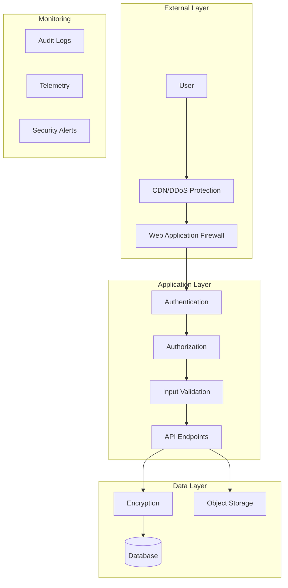

# Security and Compliance Documentation

## Security Overview

Algorhythmic implements defense-in-depth security with multiple layers of protection for user data, authentication, and system integrity. The platform follows OWASP best practices and maintains compliance with data protection regulations.

### Security Architecture



## Authentication & Authorization

### Authentication System

**Technology**: Replit Auth with OpenID Connect (OIDC)

```typescript
// Authentication flow
1. User clicks login
2. Redirect to Replit Auth provider
3. User authenticates with Replit
4. Callback with authorization code
5. Exchange code for tokens
6. Create session with JWT
```

**Session Management**
```typescript
// Express session configuration
app.use(session({
  secret: process.env.SESSION_SECRET, // REDACTED
  resave: false,
  saveUninitialized: false,
  store: new PGStore({
    pool: pgPool,
    tableName: 'sessions'
  }),
  cookie: {
    secure: process.env.NODE_ENV === 'production',
    httpOnly: true,
    maxAge: 7 * 24 * 60 * 60 * 1000, // 7 days
    sameSite: 'strict'
  }
}));
```

**Token Management**
```typescript
// JWT token refresh
export const isAuthenticated = async (req, res, next) => {
  const user = req.user;
  
  if (!req.isAuthenticated() || !user.expires_at) {
    return res.status(401).json({ message: "Unauthorized" });
  }
  
  const now = Math.floor(Date.now() / 1000);
  
  // Refresh if token expires in <5 minutes
  if (user.expires_at - now < 300) {
    try {
      const tokens = await refreshTokens(user.refresh_token);
      updateUserSession(user, tokens);
    } catch {
      return res.status(401).json({ message: "Token refresh failed" });
    }
  }
  
  next();
};
```

### Authorization Model

**Role-Based Access Control (RBAC)**

| Role | Permissions | Endpoints |
|------|------------|-----------|
| `anonymous` | Read public content | `/api/health`, `/api/preferences` |
| `free` | Basic generation (100/month) | `/api/generate-art`, `/api/vote` |
| `premium` | Enhanced generation (1000/month) | All free + priority queue |
| `business` | Bulk generation (5000+/month) | All premium + branding |
| `admin` | System management | `/api/admin/*`, `/api/monitoring/*` |

**Tier Enforcement**
```typescript
function enforceBusinessTier(req, res, next) {
  const user = req.user;
  const tier = user.subscriptionTier;
  
  if (!['business_basic', 'business_premium'].includes(tier)) {
    return res.status(403).json({ 
      message: "Business tier required" 
    });
  }
  
  next();
}
```

## Data Protection

### Encryption

#### At Rest
- **Database**: AES-256 encryption (Neon managed)
- **Object Storage**: Server-side encryption (SSE-S3)
- **Backups**: Encrypted with separate keys

#### In Transit
- **HTTPS**: TLS 1.3 enforced
- **WebSocket**: WSS protocol only
- **Database**: SSL required connections

```typescript
// Database connection with SSL
const pool = new Pool({
  connectionString: process.env.DATABASE_URL,
  ssl: {
    rejectUnauthorized: true,
    ca: process.env.DATABASE_CA // REDACTED
  }
});
```

### Data Classification

| Data Type | Classification | Protection Level | Retention |
|-----------|---------------|-----------------|-----------|
| Passwords | Critical | Never stored (OAuth only) | N/A |
| Email | PII | Encrypted, hashed for lookup | Account lifetime |
| Payment | Sensitive | Stripe tokenization only | Not stored |
| Art Preferences | User Data | Encrypted at rest | 90 days inactive |
| Generated Images | Public | CDN cached | 30 days |
| Telemetry | Metadata | Anonymized | 30 days |

### PII Handling

```typescript
// Email hashing for privacy
function hashEmail(email: string): string {
  return crypto
    .createHash('sha256')
    .update(email.toLowerCase())
    .digest('hex');
}

// Anonymization for telemetry
function anonymizeTelemetry(event: TelemetryEvent) {
  return {
    ...event,
    userId: crypto.createHash('md5').update(event.userId).digest('hex'),
    email: undefined,
    ipAddress: undefined
  };
}
```

## Input Validation & Sanitization

### Schema Validation

All API inputs validated with Zod schemas:

```typescript
// Example: Art generation request validation
const generateArtSchema = z.object({
  sessionId: z.string().uuid(),
  audioAnalysis: z.object({
    frequency: z.number().min(0).max(20000),
    amplitude: z.number().min(0).max(1),
    bassLevel: z.number().min(0).max(100),
    trebleLevel: z.number().min(0).max(100),
    tempo: z.number().min(0).max(300),
    mood: z.enum(['energetic', 'calm', 'dramatic', 'playful', 'melancholic'])
  }).optional(),
  preferences: z.object({
    styles: z.array(z.string()).max(10),
    artists: z.array(z.string()).max(10)
  }).optional()
});

// Validation middleware
app.post('/api/generate-art', (req, res) => {
  try {
    const validated = generateArtSchema.parse(req.body);
    // Process validated input
  } catch (error) {
    return res.status(400).json({ 
      message: "Invalid input",
      errors: error.errors 
    });
  }
});
```

### SQL Injection Prevention

Using parameterized queries with Drizzle ORM:

```typescript
// Safe query construction
const artworks = await db
  .select()
  .from(artSessions)
  .where(
    and(
      eq(artSessions.userId, userId),
      gte(artSessions.createdAt, startDate)
    )
  )
  .limit(10);

// Never use string concatenation
// BAD: `SELECT * FROM users WHERE id = '${userId}'`
// GOOD: Parameterized queries as above
```

### XSS Prevention

```typescript
// Content Security Policy
app.use((req, res, next) => {
  res.setHeader(
    'Content-Security-Policy',
    "default-src 'self'; " +
    "script-src 'self' 'unsafe-inline' 'unsafe-eval'; " +
    "style-src 'self' 'unsafe-inline'; " +
    "img-src 'self' data: https:; " +
    "connect-src 'self' wss: https://api.openai.com"
  );
  next();
});

// React automatically escapes output
// Additional sanitization for user content
import DOMPurify from 'isomorphic-dompurify';

function sanitizeUserContent(content: string): string {
  return DOMPurify.sanitize(content, {
    ALLOWED_TAGS: ['b', 'i', 'em', 'strong'],
    ALLOWED_ATTR: []
  });
}
```

## API Security

### Rate Limiting

Credit-based throttling instead of traditional rate limiting:

```typescript
// Credit-based rate limiting
async function creditRateLimit(req, res, next) {
  const userId = req.user.claims.sub;
  const balance = await storage.getCreditsBalance(userId);
  
  if (balance <= 0) {
    return res.status(429).json({
      message: "Rate limited - no credits remaining",
      retryAfter: getBillingCycleEnd(userId)
    });
  }
  
  next();
}
```

### CORS Configuration

```typescript
app.use(cors({
  origin: process.env.NODE_ENV === 'production'
    ? ['https://yourdomain.com']
    : ['http://localhost:5000'],
  credentials: true,
  methods: ['GET', 'POST', 'PUT', 'DELETE'],
  allowedHeaders: ['Content-Type', 'Authorization']
}));
```

### API Key Management

```typescript
// Environment variables only - NEVER in code
const KEYS = {
  OPENAI_API_KEY: process.env.OPENAI_API_KEY, // REDACTED
  STRIPE_SECRET_KEY: process.env.STRIPE_SECRET_KEY, // REDACTED
  ACRCLOUD_ACCESS_KEY: process.env.ACRCLOUD_ACCESS_KEY, // REDACTED
  ACRCLOUD_ACCESS_SECRET: process.env.ACRCLOUD_ACCESS_SECRET // REDACTED
};

// Key rotation reminder
if (Date.now() > getKeyRotationDate()) {
  console.warn('API keys due for rotation');
}
```

## Security Headers

```typescript
app.use(helmet({
  contentSecurityPolicy: {
    directives: {
      defaultSrc: ["'self'"],
      styleSrc: ["'self'", "'unsafe-inline'"],
      scriptSrc: ["'self'", "'unsafe-inline'"],
      imgSrc: ["'self'", "data:", "https:"],
      connectSrc: ["'self'", "wss:", "https://api.openai.com"]
    }
  },
  hsts: {
    maxAge: 31536000,
    includeSubDomains: true,
    preload: true
  }
}));

// Additional security headers
app.use((req, res, next) => {
  res.setHeader('X-Frame-Options', 'DENY');
  res.setHeader('X-Content-Type-Options', 'nosniff');
  res.setHeader('Referrer-Policy', 'strict-origin-when-cross-origin');
  res.setHeader('Permissions-Policy', 'camera=(), microphone=(), geolocation=()');
  next();
});
```

## Audit Logging

### Audit Events

```typescript
// Critical events to audit
const auditEvents = [
  'user.login',
  'user.logout',
  'user.tier_change',
  'payment.success',
  'payment.failure',
  'generation.bulk',
  'admin.action',
  'security.violation'
];

function auditLog(event: string, userId: string, metadata: any) {
  const entry = {
    timestamp: new Date(),
    event,
    userId,
    ipAddress: req.ip, // Hashed for privacy
    userAgent: req.headers['user-agent'],
    metadata
  };
  
  // Store in secure audit table
  await db.insert(auditLogs).values(entry);
  
  // Alert on security events
  if (event.startsWith('security.')) {
    await sendSecurityAlert(entry);
  }
}
```

### Compliance Logging

```typescript
// GDPR compliance tracking
interface GDPRLog {
  userId: string;
  action: 'consent' | 'access' | 'deletion' | 'portability';
  timestamp: Date;
  details: any;
}

// Log all GDPR-related actions
async function logGDPRAction(log: GDPRLog) {
  await db.insert(gdprLogs).values(log);
}
```

## Vulnerability Management

### Dependency Scanning

```bash
# Regular dependency audits
npm audit

# Fix vulnerabilities
npm audit fix

# Check for updates
npm outdated

# Update dependencies safely
npm update --save
```

### Security Testing

```bash
# SAST scanning (planned)
npm run security:scan

# Penetration testing checklist
- [ ] SQL injection tests
- [ ] XSS payload tests
- [ ] Authentication bypass attempts
- [ ] Authorization escalation tests
- [ ] Session fixation tests
- [ ] CSRF token validation
```

## Incident Response

### Security Incident Procedures

1. **Detection**
   - Automated alerts from monitoring
   - User reports
   - Audit log anomalies

2. **Containment**
   ```typescript
   // Emergency shutdown
   async function emergencyShutdown(reason: string) {
     // Disable affected endpoints
     app.use('/api/*', (req, res) => {
       res.status(503).json({ message: "Service temporarily disabled" });
     });
     
     // Log incident
     await auditLog('security.shutdown', 'system', { reason });
     
     // Alert team
     await sendEmergencyAlert(reason);
   }
   ```

3. **Investigation**
   - Review audit logs
   - Analyze attack patterns
   - Identify affected data

4. **Recovery**
   - Patch vulnerabilities
   - Reset affected credentials
   - Restore from clean backups

5. **Post-Incident**
   - Document lessons learned
   - Update security procedures
   - Notify affected users if required

## Compliance

### GDPR Compliance

```typescript
// Data subject rights implementation
class GDPRController {
  // Right to access
  async exportUserData(userId: string) {
    const data = {
      profile: await db.select().from(users).where(eq(users.id, userId)),
      artworks: await db.select().from(artSessions).where(eq(artSessions.userId, userId)),
      preferences: await db.select().from(artPreferences).where(eq(artPreferences.userId, userId))
    };
    return data;
  }
  
  // Right to deletion
  async deleteUserData(userId: string) {
    await db.transaction(async (tx) => {
      await tx.delete(artSessions).where(eq(artSessions.userId, userId));
      await tx.delete(telemetryEvents).where(eq(telemetryEvents.userId, userId));
      await tx.delete(users).where(eq(users.id, userId));
    });
  }
  
  // Right to portability
  async exportPortableData(userId: string) {
    const data = await this.exportUserData(userId);
    return JSON.stringify(data, null, 2);
  }
}
```

### Payment Card Industry (PCI) Compliance

- **Level**: SAQ-A (Stripe handles all card data)
- **Scope**: No card data stored or processed
- **Implementation**: Stripe Elements, tokenization only

```typescript
// Never handle raw card data
// Use Stripe tokens only
const paymentIntent = await stripe.paymentIntents.create({
  amount: 1000,
  currency: 'usd',
  payment_method: token, // Token from Stripe Elements
  customer: customerId
});
```

## Security Checklist

### Development
- [ ] Input validation on all endpoints
- [ ] SQL injection prevention via ORM
- [ ] XSS prevention in React components
- [ ] CSRF tokens for state-changing operations
- [ ] Secure session configuration
- [ ] No secrets in code

### Deployment
- [ ] HTTPS enforced
- [ ] Security headers configured
- [ ] Environment variables for secrets
- [ ] Database SSL required
- [ ] Audit logging enabled
- [ ] Monitoring alerts configured

### Operations
- [ ] Regular dependency updates
- [ ] Security patches applied
- [ ] API key rotation schedule
- [ ] Backup encryption verified
- [ ] Incident response plan tested
- [ ] Compliance audits completed

## Cross-References

- [API Documentation](02-services-and-interfaces.md)
- [Data Storage](03-data-and-storage.md)
- [Operations Runbook](07-ops-runbook.md)
- [Build & Deploy](05-build-test-deploy.md)